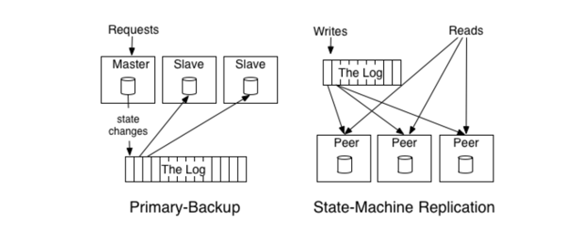
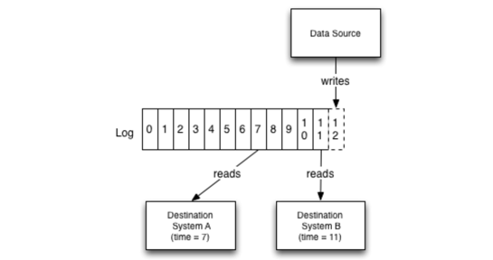
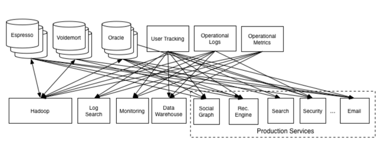

# The Log: What every software engineer should know about real-time data's unifying abstraction 

- [paper link](https://engineering.linkedin.com/distributed-systems/log-what-every-software-engineer-should-know-about-real-time-datas-unifying)

## 1. 로그
- 단순한 개념, 가장 단순한 추상화 즉 로그를 가지고 있다는 것입니다.
- 로그를 이해하지 않고는 데이터베이스, NoSQL 저장소, 키 값 저장소, 복제, paxos, hadoop, 버전 제어 또는 거의 모든 소프트웨어 시스템을 완전히 이해할 수 없습니다.
- 로그는 파일이나 테이블과 크게 다르지 않습니다. 파일은 바이트 배열이고, 테이블은 레코드 배열이며, 로그는 실제로 레코드가 시간별로 정렬된 테이블이나 파일의 일종일 뿐입니다.

### 데이터베이스의 로깅
- 데이터베이스 전문가들은 일반적으로 **물리적 로깅** 과 **논리적 로깅**을 구분합니다. 
  - 물리적 로깅은 변경된 각 행의 내용을 로깅하는 것을 의미
  - 논리적 로깅은 변경된 행이 아니라 행 변경으로 이어지는 SQL 명령(삽입, 업데이트 및 삭제 명령문)을 로깅하는 것을 의미

## state machine model VS. primary-backup model


### state machine model
일반적으로 들어오는 요청의 로그를 보관하고 각 복제본이 각 요청을 처리하는 active-active 모델을 의미합니다.

- 장점:
  - 일관성(Consistency)이 강하게 보장됩니다. 
  - 다중 마스터처럼 작동하여 데이터의 고가용성을 제공합니다.
- 단점:
  - 모든 노드 간 동기화가 필수이므로 네트워크와 성능에 부담을 줄 수 있습니다. 
  - 쓰기 성능이 제한될 수 있음.
- DynamoDB, ZooKeeper

### primary-backup model 
하나의 복제본을 리더로 선출하고 이 리더가 요청이 도착한 순서대로 요청을 처리하고 요청을 처리한 상태의 변경 사항을 로그아웃하도록 허용하는 것입니다.

- 장점: 
  - 쓰기 성능은 Primary에서만 처리되므로 최적화가 용이합니다.
- 단점:
  - 데이터 복제가 비동기로 이루어질 경우 데이터 유실 가능성 존재. 
  - 읽기/쓰기 분리가 강제되므로 다중 마스터 환경이 어렵습니다.
- MySQL


| **특징**            | **State Machine Model**             | **Primary-Backup Model**           |
|----------------------|-------------------------------------|-------------------------------------|
| **작동 방식**       | 모든 복제본이 동일한 명령 수행      | 마스터가 계산, 결과를 백업에 전달  |
| **일관성 보장**     | 명령 순서를 모두 맞춰야 함          | 마스터가 순서를 보장               |
| **장점**            | 모든 복제본 활성                   | 단순하고 중앙 집중적 관리 가능     |
| **단점**            | 순서 어긋나면 값 불일치 위험        | 마스터 장애 시 중단 가능성         |


#### 로그와 합의의 관계
- 로그(log): 데이터를 순서대로 저장하는 일종의 기록장. 
  - 예: "1번 작업: 데이터 A 저장" → "2번 작업: 데이터 B 저장" → "3번 작업: 데이터 C 저장"
- 합의(consensus): 로그에 기록할 데이터를 여러 컴퓨터(복제본)들이 합의해서 결정하는 것.
  - 예: "다 같이 데이터 A를 1번 자리에 저장하는 데 동의하자!"

```
로그는 회사의 회의록처럼, 모든 결정과 행동을 시간 순서대로 기록하는 역할을 합니다.
합의 알고리즘은 회의 중 참석자들이 "다 같이 이 결정에 동의합시다!"라고 말하는 과정입니다.
지금까지는 사람들이 "합의 과정" 자체에 집중했지만, 앞으로는 "어떻게 잘 정리된 회의록(로그)을 유지할 것인가"에 더 초점이 맞춰질 것이다.
```

### Changelog 101: Tables and Events are Dual
변경 로그(log)와 테이블(table) 사이에는 흥미로운 이중성(duality)이 있습니다. 로그는 은행이 처리하는 모든 입출금 내역과 비슷하고, 테이블은 현재의 계좌 잔액을 보여줍니다. 로그의 놀라운 점은, 변경 사항이 모두 담긴 완전한 로그라면 테이블의 최종 버전뿐만 아니라 과거에 존재했던 모든 버전을 재생성할 수 있다는 것입니다. 이는 본질적으로 테이블의 이전 모든 상태를 백업하는 역할을 합니다.

버전 관리는 분산 데이터 시스템이 해결해야 하는 문제, 즉 분산된 동시 상태 변경을 관리하는 문제와 매우 유사한 문제를 해결합니다. 버전 관리 시스템은 일반적으로 패치(patch) 시퀀스를 모델링하는데, 이는 사실상 로그입니다. 사용자는 현재 코드의 "스냅샷(snapshot)"을 체크아웃하여 직접 작업하는데, 이는 테이블과 유사합니다. 또한, 버전 관리 시스템에서, 그리고 다른 분산 상태 시스템에서도 복제(replication)는 로그를 통해 이루어진다는 점을 알 수 있습니다.


## 2. 데이터 통합(Data Integration)
- 조직의 모든 데이터를 저장 및 처리 시스템에서 쉽게 사용할 수 있도록 만드는 방법.

기존의 ETL(데이터 추출, 변환, 적재)을 실시간 시스템과 처리 흐름으로 확장한 개념.
중요성:
- 빅데이터 기술이 아무리 강조되더라도, 데이터를 사용할 수 있게 만드는 것이 조직에 가장 중요한 과제 중 하나.
- 데이터 활용은 마슬로우의 욕구 피라미드와 유사하게 단계적으로 이루어짐:
  1. 데이터 캡처와 일관된 모델링이 가장 기본.
  2. 데이터 처리 인프라 구축(MapReduce, 실시간 쿼리 시스템 등).
  3. 고급 데이터 모델, 시각화, 알고리즘 처리 등으로 발전.
- 현실의 문제:
  - 많은 조직이 기본적인 데이터 흐름이 불완전한 상태에서 고급 데이터 분석으로 직행하려는 실수를 범함.

#### 데이터 통합의 복잡성 하나. 이벤트 데이터의 폭발적 증가 
이벤트 데이터는 현재 상태가 아니라 발생한 일을 기록합니다. 웹 시스템에서는 사용자 활동 로그, 데이터 센터의 머신 운영 및 모니터링을 위한 머신 수준 이벤트와 통계가 포함됩니다. 사람들은 이를 종종 "로그 데이터(log data)"라고 부르는데, 이는 형태와 기능을 혼동한 표현입니다.

이벤트 데이터는 현대 웹의 핵심입니다. 예를 들어, 구글의 수익은 클릭과 노출(impression)이라는 이벤트 데이터를 기반으로 한 **관련성 파이프라인(relevance pipeline)**에서 발생합니다.


#### 데이터 통합의 복잡성 둘. 전문화된 데이터 시스템의 폭발적 증가
지난 5년간 OLAP, 검색, 간단한 온라인 스토리지, 배치 처리, 그래프 분석 등을 위한 전문화된 시스템이 대중화되고 무료로 제공되는 경우도 많아졌습니다.

데이터의 양이 늘어나고 유형이 다양해짐에 따라, 이 데이터를 다양한 시스템에 통합하려는 요구가 커지면서 거대한 데이터 통합 문제가 발생했습니다

#### 로그 구조 데이터 흐름(Log-Structured Data Flow)
**로그(log)** 는 시스템 간 데이터 흐름을 처리하기에 가장 자연스러운 데이터 구조입니다.

이 접근법은 간단한 원리를 따릅니다:
- 조직의 모든 데이터를 중앙 로그에 넣어 실시간으로 구독 가능하게 만듭니다.
- 각 논리적 데이터 소스는 고유한 로그로 모델링됩니다. 
  - 데이터 소스는 이벤트(예: 클릭, 페이지 뷰)를 기록하는 애플리케이션이 될 수도 있고, 수정 사항을 처리하는 데이터베이스 테이블이 될 수도 있습니다.
- 각 구독 시스템은 이 로그에서 가능한 한 빠르게 데이터를 읽어 들이고, 새 레코드를 자체 저장소에 적용하며, 로그에서 자신의 위치를 업데이트합니다.
- 구독 시스템은 캐시, 하둡, 원격 사이트의 다른 데이터베이스, 검색 시스템 등 어떤 종류라도 될 수 있습니다.



#### 논리적 시계(Logical Clock) 제공:
- 로그는 각 변경에 대해 "시점(point in time)"을 제공하여, 구독자 시스템 간 상태를 비교하고 동기화하는 것을 단순화함.
- 오래된 데이터를 방지하려면, 특정 로그 항목까지 복제되지 않은 시스템에서 데이터를 읽지 않도록 보장하면 됨.

#### 데이터 생성과 소비의 비동기 처리:
- 로그는 버퍼 역할을 하여 데이터를 생성하는 시스템과 소비하는 시스템 간의 비동기 처리를 가능하게 함.
- 서로 다른 속도로 데이터를 소비하는 구독자(실시간 시스템, 배치 처리 등)를 유연하게 지원.

#### 구독자의 독립성 보장:
- 로그는 데이터 소비 시스템(캐시, 데이터 웨어하우스, 실시간 쿼리 시스템 등)의 상태를 알 필요 없음.
- 구독 시스템은 중단 후 복구 시 자신이 제어하는 속도로 로그를 따라잡을 수 있음.
- 새로운 소비 시스템을 추가하거나 제거해도 데이터 파이프라인에는 영향을 주지 않음.


> 모든 정상적으로 작동하는 데이터 파이프라인은 로그처럼 설계되어 있다. 하지만 고장난 데이터 파이프라인은 고장난 방식도 제각각이다."  
> — 레오 톨스토이 (저자의 번역)

목적지 시스템은 **로그(log)** 만 알고 있을 뿐, 데이터가 어디서 왔는지에 대한 자세한 정보는 알 필요가 없습니다. 소비 시스템은 데이터가 RDBMS에서 왔는지, 최신 키-값 저장소에서 왔는지, 아니면 실시간 쿼리 시스템 없이 생성되었는지 신경 쓸 필요가 없습니다. 이 점은 사소해 보이지만, 사실 매우 중요한 포인트입니다.

저는 여기서 "로그"라는 용어를 **메시징 시스템(messaging system)** 이나 퍼블리시-서브스크라이브(pub-sub) 대신 사용합니다. 그 이유는 로그가 의미적으로 더 구체적이며, 실질적인 데이터 복제를 지원하기 위한 구현에 더 가까운 설명이기 때문입니다.
퍼블리시-서브스크라이브라는 용어는 단순히 메시지의 간접 주소 지정(indirect addressing)을 의미할 뿐, 그 이상의 의미를 암시하지 않습니다. 실제로 퍼블리시-서브스크라이브를 제공한다고 약속하는 메시징 시스템 두 개를 비교하면, 이들이 보장하는 기능이 매우 다르고 대부분의 모델은 이 영역에서 유용하지 않습니다.

로그는 **내구성 보장(durability guarantees)**과 **강력한 순서 보장(strong ordering semantics)**을 제공하는 일종의 메시징 시스템처럼 동작한다고 볼 수 있습니다. 분산 시스템에서는 이러한 커뮤니케이션 모델을 종종 "원자적 브로드캐스트(atomic broadcast)"라고 부르는데, 이 명칭은 약간 부적절하다고 생각됩니다.


#### 로그는 단지 인프라일 뿐이다.
로그는 데이터 흐름 관리의 전부가 아닙니다. 데이터를 완벽히 다루기 위해서는 메타데이터(metadata), 스키마(schema), 호환성(compatibility), 데이터 구조와 진화(evolution) 처리의 모든 세부사항을 포함한 작업이 필요합니다. 하지만 데이터 흐름의 기계적 처리를 위한 신뢰할 수 있는 일반적인 방법이 없이는, 의미론적 세부사항은 부차적인 문제로 남습니다.


### LinkedIn에서 Kafka까지의 여정

#### 데이터 통합의 초기 문제

LinkedIn은 다양한 데이터 소스와 소비 시스템(데이터베이스, Hadoop 등)을 연결하기 위해 맞춤형 파이프라인을 구축했으나, O(N²) 파이프라인이 필요해 비효율적이고 운영이 어려운 상황에 직면.

#### 해결 방향
데이터를 모든 소비자가 접근할 수 있는 단일 중앙 파이프라인으로 처리해야 한다는 필요성을 인식.
새로운 데이터 소스나 소비 시스템을 추가할 때, 단일 파이프라인만 연결하면 되도록 설계 변경.

#### Kafka의 탄생
메시징 시스템과 분산 시스템의 로그(log) 개념을 결합하여 Kafka를 개발.
초기에는 활동 데이터(activity data)를 통합하는 데 사용되었으며, 이후 Hadoop 데이터 배포, 모니터링 등 다양한 용도로 확장.

#### AWS Kinesis와의 유사성
Amazon의 Kinesis는 Kafka와 매우 유사한 방식으로 설계(파티셔닝, 데이터 보존 등), 이는 Kafka의 추상화 모델이 효과적임을 입증.
Kinesis는 Amazon의 분산 시스템(DynamoDB, RedShift 등)을 연결하는 데이터 파이프라인으로 활용됨.


### ETL과 로그 기반 데이터 통합

#### ETL의 한계와 데이터 웨어하우스 문제
- 데이터 웨어하우스는 분석과 보고에 적합하지만, 실시간 처리나 검색 색인, 모니터링 같은 실시간 요구사항을 충족하지 못함.
- 기존 ETL 파이프라인은 데이터 소스마다 맞춤형 작업이 필요해 확장성과 유지보수에 어려움이 있음.

#### 로그 기반 중앙 파이프라인의 필요성
- 데이터 생성자는 로그에 데이터를 추가하기 전에 정리(cleanup)와 표준화(canonical form) 작업을 수행.
- 로그는 정리된 데이터를 중심으로 실시간 처리와 다양한 시스템(검색, 모니터링, 데이터 웨어하우스) 통합을 지원.

#### 데이터 처리의 세 단계
- 로그 게시 전: 데이터 생성자가 정리 및 표준화(비손실적, 가역적).
- 실시간 변환: 로그 피드 기반으로 세션화, 파생 필드 추가 등 부가가치 작업.
- 목적지 로드 시: 데이터 웨어하우스에 맞춘 스키마 변환 및 집계.

#### ETL VS. 로그 기반 중앙 파이프라인
| **단계**             | **ETL**                                                                 | **로그 기반 중앙 파이프라인**                              |
|----------------------|------------------------------------------------------------------------|----------------------------------------------------------|
| **1. 데이터 추출**    | 다양한 소스(데이터베이스, API 등)에서 데이터를 추출                      | 데이터 생성자가 로그에 데이터를 추가                      |
| **2. 데이터 변환**    | 데이터 정리(결측값 제거, 오류 수정), 구조 변환(날짜 형식 통일), 집계 등    | 실시간 변환을 통해 파생 필드 추가, 세션화 등 처리          |
| **3. 데이터 적재**    | 변환된 데이터를 데이터 웨어하우스에 적재 (스타/스노우플레이크 스키마 등)   | 목적지 시스템의 요구사항에 맞춘 최종 변환 후 데이터 로드    |


#### 결과
- 데이터 웨어하우스 팀의 부담 감소 및 데이터 흐름 안정성 증가.
- 모든 데이터 시스템이 중앙 로그와 단일 통합 작업으로 연결되어 확장성과 효율성 확보.


### 로그 기반 이벤트 처리와 이점

#### 문제점
- 기존 배치 기반 ETL은 데이터 웨어하우스의 처리 능력과 일정에 종속적.
- 단순한 작업(예: 채용 공고 표시)이 여러 시스템(분석, 보안, 추천 등)과 얽히며 복잡성이 증가.
- 새로운 데이터 소비자를 추가하면 기존 코드를 수정해야 하는 비효율 발생.

#### LinkedIn의 접근 방식
- Kafka를 활용해 중앙 이벤트 로그를 생성.
- 각 이벤트(페이지 조회, 광고 노출 등)를 고유 속성으로 캡처하고, 필요한 모든 시스템이 이를 구독.

#### 이벤트 기반 방식의 장점
- 비결합성: 이벤트를 기록하는 시스템은 소비자 시스템을 알 필요 없음.
- 유연성: 새로운 데이터 소비자를 추가해도 기존 코드를 변경할 필요 없음.
- 확장성: 모든 시스템이 중앙 로그를 통해 데이터에 접근 가능, 복잡한 통합 작업 불필요.


### 확장 가능한 로그

#### 확장 가능한 로그의 필요성
- 소비자 규모의 웹사이트에서 발생하는 모든 이벤트를 실시간으로 기록하는 로그를 구축하려면 빠르고, 확장 가능하며, 비용 효율적이어야 함.
- LinkedIn은 Kafka를 사용해 하루 600억 개 이상의 메시지를 처리하며, 데이터센터 간 미러링까지 포함하면 수천억 개에 달함.

#### Kafka의 주요 기술
- 로그 분할(Partitioning):
  - 로그를 파티션으로 나눠 수평 확장 가능.
  - 각 파티션은 정렬된 로그를 유지하며, 파티션 간 글로벌 순서는 보장하지 않음.
- 복제(Replication):
  - 각 파티션은 복제되며, 리더 장애 시 다른 복제본이 리더 역할을 대신함.
- 순서 보장:
  - 각 파티션 내에서 순서를 보장하며, 단일 송신자의 메시지는 전송된 순서대로 전달.

#### 최적화 기법
- 배치 처리(Batching): 클라이언트-서버 통신, 디스크 기록, 복제 등에서 배치를 사용해 처리량 극대화.
- 제로 카피(Zero-Copy) 데이터 전송: 데이터 전송 시 불필요한 복사를 줄여 네트워크 효율 향상.

#### 결과
- Kafka는 디스크나 네트워크가 지원하는 최대 속도로 데이터를 읽고 쓰며, 메모리를 초과하는 데이터 세트도 처리 가능.
- 중앙 로그 기반으로 확장 가능한 데이터 파이프라인을 구축함.

## 3. 로그와 실시간 스트림 처리
로그는 단순히 저장 시스템 간 데이터를 이동하는 것으로 끝나지 않습니다. 사실, "로그(log)"는 "스트림(stream)"의 또 다른 말이며, 로그는 스트림 처리의 핵심에 위치합니다.

#### 스트림 처리의 개념
- 스트림 처리는 데이터를 연속적으로 처리하는 인프라로, 배치 처리의 일반화된 형태.
- 실시간 데이터뿐만 아니라 과거 데이터도 처리 가능하며, 특정 SQL 엔진이나 인터페이스에 제한되지 않음.

#### 스트림 처리의 동인
- 데이터 수집 방식에 따라 처리 방식이 결정됨.
  - 배치 데이터는 배치로 처리.
  - 연속적으로 수집된 데이터는 스트림 처리로 저지연 및 자원 최적화 가능.
- LinkedIn은 대부분의 데이터를 실시간으로 수집(활동 데이터, DB 변경 등)하며, 배치 처리 비중이 거의 없음.

#### 스트림 처리의 장점
- 데이터에 시간 개념을 추가하여 사용자 정의 빈도로 결과 생성 가능.
- 배치 처리 대비 더 빠른 반응성과 실시간 데이터에 최적화된 처리 방식 제공.

#### 스트림 처리가 틈새 기술로 여겨졌던 이유
- 과거에는 실시간 데이터 수집 부족으로 인해 연속 처리 인프라의 활용도가 낮았음.
- 초기 상용 스트림 처리 시스템은 실시간 데이터 스트림이 없는 환경에서는 유용하지 않았음.

#### 로그의 역할
- 로그는 스트림 처리의 핵심 문제(실시간 다중 구독 데이터 피드 제공)를 해결.
- LinkedIn은 Kafka 기반 로그를 활용하여 실시간 데이터 스트림을 지원하며, 이를 기반으로 스트림 처리 시스템 Samza를 개발.

